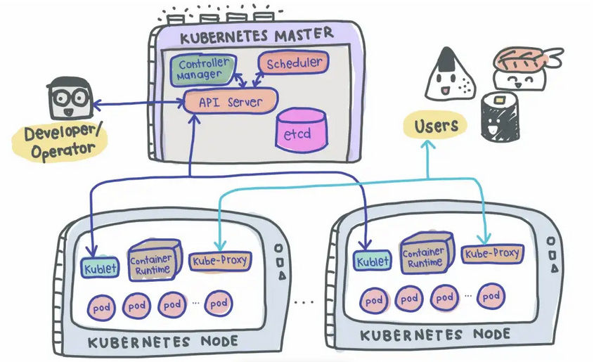

# The deep perspective of K8s
## Components in the cluster  
* ***Pod***, the smallest unit of K8s that houses an instance of your application. Acts as an abstraction over a container. Each pod gets its own IP address (public or private) and it will be a new IP address upon re-creation of a pod.  
* ***Deployment***, describes how the many replicas of a pod should be started, monitored and what other resources they should use (disk mappings, environment variables, secrets etc). This is what the ***Kubelet*** and the ***Container Runtime*** is using (see below).   
* ***Service***, because pods are meant to be ephemeral, the service provides a way to “give” pods a permanent common IP address. If the pod dies, its IP address will not change upon re-creation. Acts almost like a load balancer routing traffic to pods while maintaining a static IP. Like load balancers, the service can also be internal or external, where external service is public facing (public IP) and internal service which is meant for internal applications (private IP).  
* ***Ingress***, in practise we can not and should not interact directly with a service, pod or container directly over the IP address. Instead we need a way to do some host address forwarding where we declare that a particular host address request should be redirected to a certain service. The ingress is responsible of doing SSL termination as well so all traffic inside the cluster will use plain text. All these rules are what we call an ingress but to handle this we also need an ingress controller, that is what we can see in our K3d-K3s scenarion by the name ***k3d-k3s-serverlb***

## Master node  
Each master node contains following services:  
* ***API Server***, main entrypoint for working with the content of the cluster, this is the contact surface for ***kubectl***, ***k9s***, ***helm*** or any other tool that interacts with the configuration of the cluster somehow. Listens externally on port 16443 and internally over 6443.  
* ***Scheduler***, decides which node a pod should be started in. It never starts the pod itself, that is the responsibility of the ***Kubelet***.  
* ***Controller Manager***, reacts upon any changes in the actual cluster regarding the desired configuration/state. If a pod dies for example it will immediately try to restart it. It will not restart it on its own, first it will ask ***Scheduler*** that makes a decision if it should be restarted and in what node, after that the ***Controller Manager*** will tell the ***Kubelet*** in that node to spin up the new pod.  
* ***etcd***, this is the key-value store of the cluster state, in default K3s it consists of a SQLite database but in real world it is often a store named etcd, special built for this purpose. It does not store any application data, only the configuration and state of the cluster!  
* ***Kubelet***, Interacts with both the node and the containers. Uses the configurations to tell the ***Container Runtime*** to start or stop containers.  
* ***Container Runtime***, the service that makes sure that a container starts or stops, usually based on Docker or containerd.  
* ***Kube Proxy***, A network proxy that implements part of the Kubernetes service concept. Sits between nodes and forwards the requests intelligently (either intra-node or inter-node forwarding).  
  
## Slave/Worker/Agent node  
The Slave/Worker/Agent nodes never acts as a master plane for the cluster and because of that they do not host any ***API Server***, ***Scheduler***, ***Controller Manager*** or ***etcd***!  
They do NOT listen to port 16443/6443, the only work they do is to keep everything up and running and redirect the traffic against the containers by using the ***Kubelet***, ***Container Runtime*** and the ***Kube Proxy***.  

## Conclusion  
* A cluster must have at least one master node. In our K3d/K3s scenario it is the K3s container we use that are named *k3d-k3s-server-n*.  
* Even if we have several master nodes, it will still be only one that is the main contact surface for the ***API Server*** (the external configuration tools). The master nodes will vote internally on startup who should act as the master of the masters and they will talk with each others over the internal port 6443.  
* The master nodes are capable of doing all the work on their own, hence we only need one single master node to get a fully working cluster.  
* We could have any number of Slave/Worker/Agent nodes in our cluster and the master nodes will decide which deployment should go where through the ***Scheduler***.  

